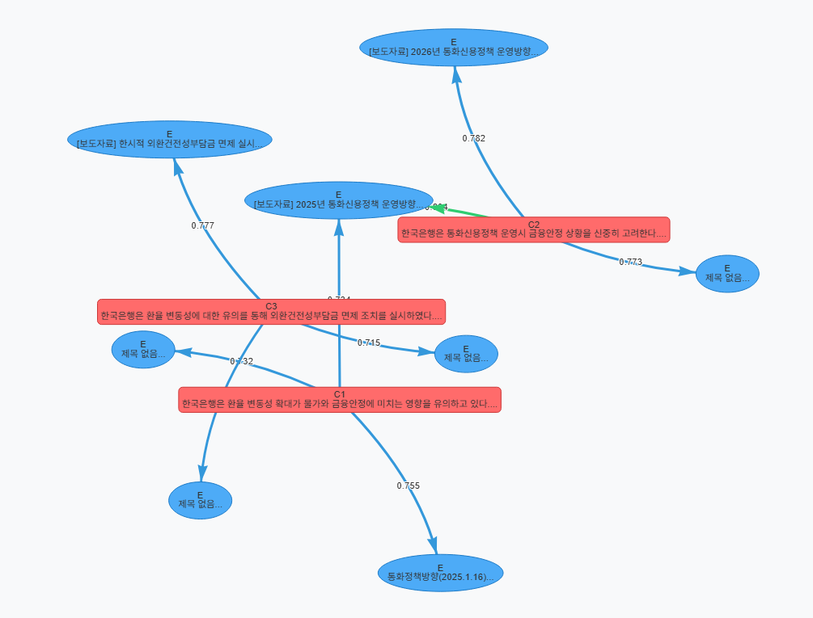
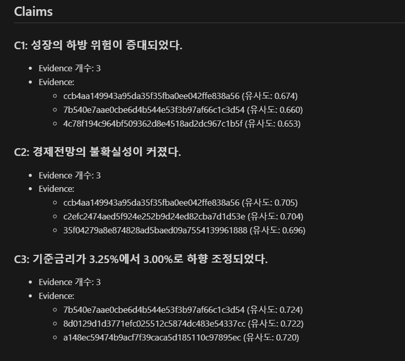

# 근거 기반 경제 리포트 에이전트 (RAG + LangGraph + GoT)

한국은행(BOK) 보도자료를 수집/정제하고 벡터DB(ChromaDB)에 인덱싱한 뒤, 질의에 대해 **Claim–Evidence(근거)** 구조로 리포트를 생성하는 RAG 프로젝트입니다.  
워크플로우는 **LangGraph**로 구성되어 재현 가능하며, 결과를 `report.md`와 **인터랙티브 HTML 그래프**로 확인할 수 있습니다.




---

## 주요 기능

- **수집(Ingest)**: BOK RSS → 웹/첨부(PDF)에서 본문 추출 + UI/메타 노이즈 제거
- **인덱싱(Index)**: 청킹/필터링 → 임베딩(`intfloat/multilingual-e5-base`) → ChromaDB 저장
- **실행(Run)**: retrieve → claim 추출(LLM) → claim별 evidence 재검색 → 검증 → `report.md` 생성
- **시각화(Viz)**: `report.md` + `retrieved_chunks.json` 기반 GoT 그래프 HTML 생성

---

## 파일 트리 (요약)

```
RAG_LangGraph/
├── README.md
├── .env
├── requirements.txt
├── images/                     # README 이미지
├── chroma_db/                  # 로컬 ChromaDB 저장소
├── artifacts/
│   └── runs/<run_id>/          # 실행 산출물(원본/로그/리포트/그래프)
└── src/
    └── kref_rag/
        ├── main.py             # CLI 엔트리포인트
        ├── config.py           # 모델/청킹/경로 설정
        ├── ingest/             # RSS/웹/PDF 수집 및 정제
        ├── indexing/           # 청킹/필터링, 벡터DB upsert/query
        ├── rag/                # LangGraph 워크플로우(GoT)
        ├── viz/                # HTML 그래프 시각화(PyVis)
        └── utils/              # 로깅 등 유틸
```

---

## 설치

### 1) 패키지 설치

```bash
pip install -r requirements.txt
```

프로젝트 설정/환경에 따라 아래 패키지도 필요합니다.

```bash
pip install langchain-openai langchain-ollama pyvis
```

> 참고: GPU용 PyTorch는 환경(CUDA 등)에 맞춰 별도로 설치하는 것을 권장합니다.

---

## 설정

### LLM 선택 (`src/kref_rag/config.py`)

- `LLM_PROVIDER`: `"ollama"` 또는 `"openai"`
- `LLM_MODEL`: 예) `qwen2.5:7b`

### OpenAI 사용 시 (`.env`)

프로젝트 루트의 `.env`에 아래처럼 설정합니다.

```
OPENAI_API_KEY=...
```

### Ollama 사용 시

로컬에서 Ollama가 실행 중이어야 합니다. (기본 주소: `http://localhost:11434`)

```bash
ollama pull qwen2.5:7b
```

---

## 사용 방법 (CLI)

이 프로젝트는 `src/`에서 실행하는 형태로 구성되어 있습니다.

```bash
cd src
```

### 1) 수집 (Ingest)

```bash
python -m kref_rag.main ingest --limit 20
```

- 콘솔에 `run_id`가 출력됩니다.
- 산출물: `artifacts/runs/<run_id>/ingest_raw.json`

### 2) 인덱싱 (Index)

```bash
python -m kref_rag.main index --run-id <run_id>
```

- 산출물: `chunks_count.txt`, `index.log`
- 벡터DB: `chroma_db/`에 컬렉션 생성

### 3) 질의 실행 (Run: RAG + GoT)

```bash
python -m kref_rag.main run --run-id <run_id> --query "질문" --top-k 6
```

- 산출물: `report.md`, `retrieved_chunks.json`, `run_query.log`

### 4) 시각화 (Viz: HTML 그래프)

```bash
python -m kref_rag.main viz --run-id <run_id> --output graph.html
```

- 산출물: `artifacts/runs/<run_id>/graph.html`

---

## 산출물 설명 (`artifacts/runs/<run_id>/`)

- `ingest_raw.json`: 수집된 문서 원본(메타 + 본문)
- `chunks_count.txt`: 생성된 청크 수
- `report.md`: 최종 리포트 (Query / Claims / Claim별 Evidence / Top Evidence)
- `retrieved_chunks.json`: 초기 retrieve 결과(top-k) 디버깅/시각화 입력
- `graph*.html`: Claim(빨강)–Evidence(파랑) 인터랙티브 그래프
- `*.log`: ingest/index/run 단계 로그

---

## Notes

- 그래프에 **"제목 없음"** Evidence가 나올 수 있습니다.  
  시각화는 `retrieved_chunks.json`의 `meta.title`을 우선 사용하며, claim별 재검색(match)으로 새로 나온 `chunk_id`가 파일에 없으면 제목을 못 찾아 폴백될 수 있습니다.

