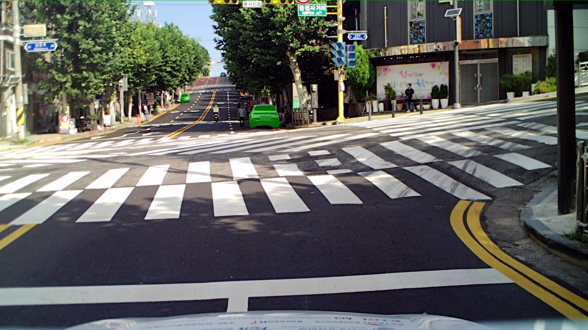
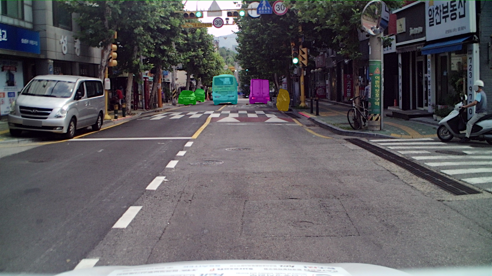
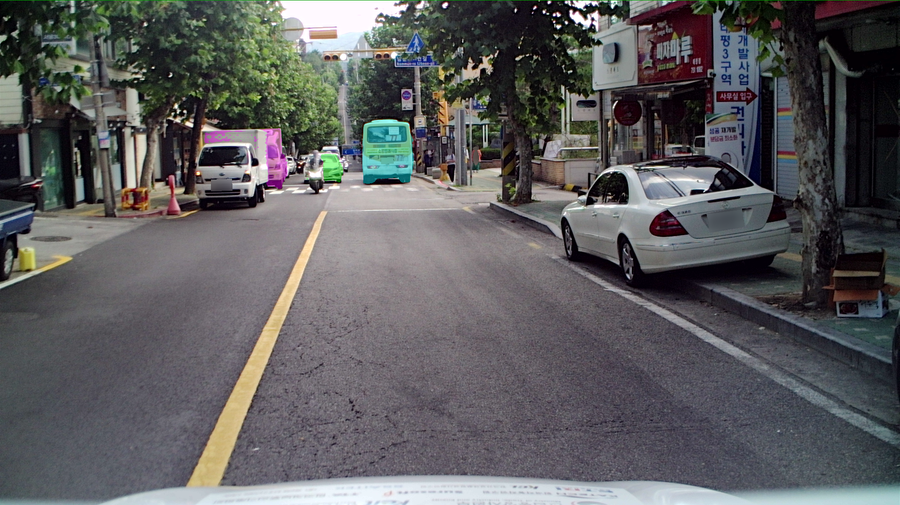

# YOLO + SAM2
> YOLO 기반 객체 탐지와 SAM2 기반 인스턴스 세그멘테이션, 오버레이 시각화로 도로 장면을 해석하는 PoC수준의 프로토타입 프로젝트입니다.

## 개요
1. 도로 장면 프레임들을 clip 단위 폴더로 정리
2. YOLO 기반 객체 검출 수행
3. SAM2 prompt를 이용해 객체 마스크 생성 및 전파
4. 프레임 단위 인스턴스 결과를 semantic map으로 변환
5. 최종 overlay 이미지를 렌더링하여 시각화


```text
YOLO_SAM2/
|- README.md
|- assets/
|  `- overlay_examples/
|     |- 000000.png
|     |- 000002.png
|     |- 000004.png
|     |- 000007.png
|     |- 000009.png
|     |- 000012.png
|     |- 000014.png
|     |- 000017.png
|     `- 000019.png
|- src/
|  |- build_clip_index.py
|  |- run_detection.py
|  |- run_sam2_image.py
|  |- run_sam2_video.py
|  |- build_semantic_map.py
|  `- render_overlay.py
`
```


## 산출물

완료된 clip에서 선별한 대표 overlay 결과입니다.





## 파일 설명

- `src/build_clip_index.py`: 파일명을 파싱하고 frame을 clip 단위로 묶으며, 필요하면 번호를 다시 부여
- `src/run_detection.py`: YOLO 검출을 수행하고 bbox JSON을 저장
- `src/run_sam2_image.py`: 단일 프레임 기준 image-mode SAM2 baseline
- `src/run_sam2_video.py`: bbox prompt 기반의 SAM2 video propagation 구현
- `src/build_semantic_map.py`: 인스턴스 마스크를 semantic class map으로 병합
- `src/render_overlay.py`: semantic map을 원본 프레임 위에 overlay 형태로 렌더링


